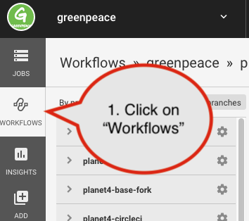
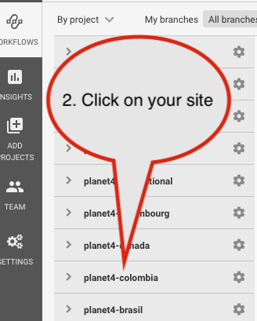
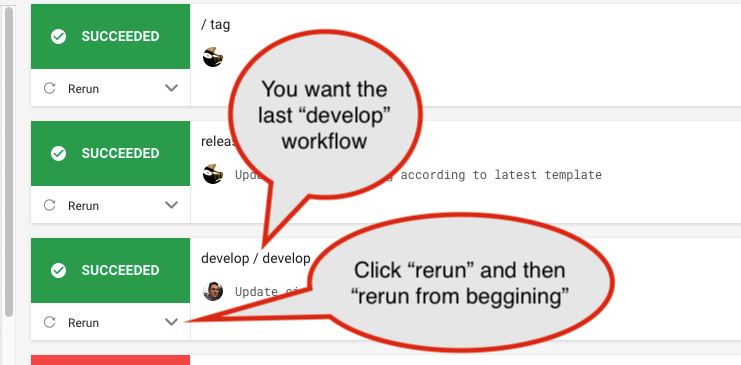

# Deployment

Our main orchestration repository for triggering deployment pipelines is [planet4-base-fork](https://github.com/greenpeace/planet4-base-fork). But before we make any change there we need first to prepare the application repositories.

### Application Repositories

The only change that it's actually needed is to tag the repositories that have new code since the previous release. But before that, we need to merge new translations.

The 3 major application repositories \([master-theme](https://github.com/greenpeace/planet4-master-theme), [plugin-gutenberg-blocks](https://github.com/greenpeace/planet4-plugin-gutenberg-blocks), [plugin-gutenberg-engagingnetworks](https://github.com/greenpeace/planet4-plugin-gutenberg-engagingnetworks)\) have a `languages` branch. This is where new translations are auto-committed from the Handbook. So first you need to merge that branch to the `master` branch. Once this is done you can rebase the languages branch from master and force push it. This will update that branch with any new translatable strings.

```text
git checkout languages
git pull
git checkout master
git pull
git merge languages
git push origin master
git checkout languages
git rebase master
git push -f origin languages
```


All merge actions should take place on local branches that are synced with the remote ones. Then push to the origin remote.


Now on each of the application repositories we can switch to the `master` branch, create a new tag and push it.

```text
git tag -a v1.90 -m "v1.90"
git push origin v1.90
```


Note the `-a` flag above. We always use [annotated tags](https://git-scm.com/book/en/v2/Git-Basics-Tagging#_annotated_tags).


### Base repository

In the repository [planet4-base-fork](https://github.com/greenpeace/planet4-base-fork), in the `develop` branch, update the versions of the plugins/themes that you are releasing and the version of composer.json \([example](https://github.com/greenpeace/planet4-base-fork/commit/0a4712ff0e3d3d1d69dfd8a1fbbac7320054a8ba#diff-b5d0ee8c97c7abd7e3fa29b9a27d1780)\). Make sure to also update the [Changelog](../tech/changelog/).


🧙 If you include in the subject line of your git commit message the string`[AUTO-PROCEED]` then, if all tests are successful, it will automatically do all the steps for deploying to production.


Check [CI](https://circleci.com/gh/greenpeace/workflows/planet4-base-fork) for the planet4-base-fork branch and wait for the workflow to finish, and all the tests to pass.

#### Promote

Now you need to merge the `develop` branch to the `release` and then the `release` branch to the `master` branch. You can do this manually if you want, but there is a job on the CI that automates this step. All you have to do is approve the "hold-promote" job.


Go back to the base-fork workflows and wait until the pipelines for master and release complete successfully.

#### Trigger Release

Go back to the base-fork develop workflow in the CI \(it must appear “on hold”\) and approve the job named “hold-trigger-sites”.


The above action will trigger develop workflows on all sites, and then automatically the release workflows. It would take at least 2.5h.

If you didn’t use the `[AUTO-PROCEED]` flag, you have to manually check all the release sites through the CI workflows. If everything looks good, go to the release-hold-and-finish workflow for each one of those \(it must appear “on hold”\) and approve the job named “hold-promote”.


If you used the `[AUTO-PROCEED]` flag, then the sites that passed Visual Regression tests will automatically trigger the production pipeline. You would only have to manually approve \(as described on the previous step\) only the ones that failed. The easiest way to see which ones failed is to go [this spreadsheet](https://docs.google.com/spreadsheets/d/1uAmZLIWYsxrBByqbhoF_vVtSM7WGebYWIc0xftPRPwE/edit#gid=390993139) and run: Planet 4 &gt; Update CircleCI. This will update the CircleCI sheet using CircleCI’s API. You can the open just the ones that are on hold.

#### Changelog

If you haven't done already, update the [Changelog](../tech/changelog/). Go back to the base-fork develop pipeline. There is one final approval job about the Changelog. This will send an email notification to the Planet 4 community.


#### Chain of jobs

From the steps above it's clear that the order of these 3 steps should be:

1. Promote
2. Trigger Sites
3. Changelog

The reason for not configuring those in a chained dependency is to leave the option for either skipping one or doing them manually. We may re-visit that at some point.


If you discover a bug during the Regression Tests report, you can open a ticket.



For GPCH and GPNL, if you see important visual differences please inform the relevant teams. They have access to approve the production pipeline, when they fix any issues. Same applies for websites that are heavily customized \(eg. Storytelling\). If something is completely broken, hold the release and notify them.



Currently, we don’t do releases on these 3 websites: Korea, Hongkong, Taiwan. These won’t be triggered anyway, so you don’t have to check them.


### Doing a release on a single NRO

This is in case you want to do a new release on just one NRO.

1. Trigger a rebuild/redeploy of the develop site with one of the following two ways:
   * If a change is needed, do commit and push a change in `composer-local.json` file of the relevant planet4-&lt;nro&gt; repository. This will trigger the Develop pipeline of this site.
   * Go to CircleCI workflows, find the site, and the latest triggered develop pipeline. Rerun it.







Wait for the new pipeline to appear, and wait until it finishes. This will do a new build/deploy of your develop site, and it will trigger a new build and deploy of your release site.

After the develop has finished building/deploying, your release site will also be build/deployed.


If you have any planet4 dependencies on `dev-develop`, then in the promotion to the release branch those will automatically change to the latest release branch of the latest stable tag of the same repository.


Wait for circleCI to build and deploy the release site.

If all has gone well, your release-hold-and-finish workflow should appear to be in “Hold”. This means that it was released successfully on your staging site, and the hold is for your production site!


Confirm that your staging site is ok and has your changes and is on the latest version. Do not run the following step unless you have confirmed the staging site.

Get inside it \(click on it\), and approve the next step \(to trigger the release to your production site\).


This should now have triggered the build/deploy of your production site. A new workflow will appear, with the word “Tag”, this is your production build/deploy workflow. Wait for the job to finish, and check your production site. If it fails, then you will have to research to see what went wrong.

