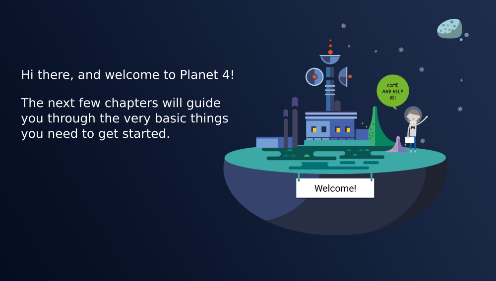

# Contribute

## Development

Planet 4 mainly consists of two repositories, for the theme and the blocks plugin. Both share code from our styleguide.

* [planet4-master-theme](https://github.com/greenpeace/planet4-master-theme)
* [planet4-plugin-gutenberg-blocks](https://github.com/greenpeace/planet4-plugin-gutenberg-blocks)

Depending on what issue you are working on, you should fork it on Github.

## Pull Requests

Before working on something or opening a Pull Request, please make sure that there is a relevant issue:

* If a relevant issue already exists, leave a comment that you are interested in working on that.
* If no relevant issue exists, open a new one and initiate the discussion.

We use the [planet4](https://github.com/greenpeace/planet4/issues) repository to track tickets that are open for contribution.

All Pull Requests should target the `master` branch. Make sure to reference the relevant issue in your Pull Request description and follow our [git guidelines](git-guidelines.md).

## Coding

In general we try to stick as close as possible to [WordPress Coding Standards](https://make.wordpress.org/core/handbook/best-practices/coding-standards/php/). The best approach to make sure your code is following planet4’s coding style is to use code linters. Most code editors have integrations and plugins for linting the code in realtime. We already have linter configuration in our repositories. Here is a list of the linters we use:

* PHP: [PHP\_CodeSniffer](https://github.com/squizlabs/PHP_CodeSniffer)
* Javascript: [ESLint](https://eslint.org/)
* CSS/Sass: [Stylelint](https://stylelint.io/)

## Code Of Conduct

In the interest of fostering an open, inclusive and welcoming environment, our project is following a [Contributor Code of Conduct](https://www.contributor-covenant.org/version/1/4/code-of-conduct).

## Contributing code

So, you want to contribute to the development of planet4? Thank you! Here are some steps to help you get started and make sure your experience is smooth.

1. Follow the steps on [the installation page](./installation.md).
2. Make sure you can load the test page at <http://www.planet4.test/>.
3. Open two terminals:
    - In one terminal, go to `planet4-docker-compose/persistence/app/public/wp-content/themes/planet4-master-theme` and run `npm i && npm start`
    - In the other terminal, go to `planet4-docker-compose/persistence/app/public/wp-content/plugins/planet4-plugin-gutenberg-blocks` and run `npm i && npm start`
4. Now, autobuild is activated for both projects. Any change to JavaScript or Sass will automatically be recompiled and deployed your test environment. Note that the order matters here. Live reload will only work on the first process you run, so switch order if you want live reload on gutenberg-blocks.
    - If you are not seeing changes, it might be that nginx is caching too aggressively. Try changing the query string in the url. Eg- `http://www.planet4.test?x=1`

### Seeing changes to a block

The `planet4-plugin-gutenberg-block` project uses Wordpress's [gutenberg-blocks](https://wordpress.org/plugins/wpdm-gutenberg-blocks/) to enable a wysiwyg editor in the admin page.

If you want to make a change to a block, and see it in use, go to the admin page: <http://www.planet4.test/wp-admin/> (user/pass: admin) and select _Pages_. Choose a page to edit (eg- "All Blocks Page"). Add the block you want to view (this page includes most of the default blocks) and make sure all of the required wysiwyg fields are entered (otherwise WP will silently decide to avoid showing the block).

After adding your block, click on _Update_ and then _Preview_. You should now see your changes.

### A few notes

- Some of the blocks are prefixed with `Old`, eg- `OldCarouselheader`. These blocks will soon be deprecated, but are still used by default. And in the admin page, these will be the only ones you see and the word _Old_ will not be displayed. 
- To see the _new_ blocks, go to <http://www.planet4.test/wp-admin/admin.php?page=planet4_settings_features> and select "Allow beta blocks in post editor." When you go back to the wysiwyg editor and click `+` to add a block, you should see these new blocks.
- Planet4 requires wordpress core 5.6. If you are not on 5.6, you may see some warnings. To fix this, log into the docker instance for wordpress:
    a. Run `docker container ls` and look for the image named `gcr.io/planet-4-151612/wordpress:ma~in`. Copy the container id
    b. Run the upgrade command: `docker exec -it <container_id> wp core upgrade --force --version=5.6`
