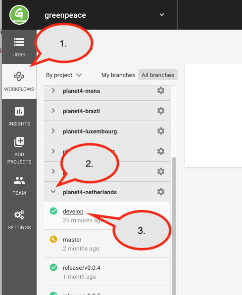
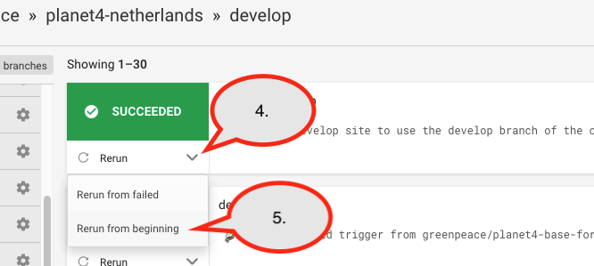

# CI

### Development Site

As a developer you want to see and demo your changes to the develop site before pushing them to staging or production. To do that, you have to do the following:

Assuming you are working your child theme \(or your custom plugin\) which is already on [packagist](../development/package-registry.md).

1. Your code must be in a branch in your repository. For example, the name of your branch is `feature/something-cool`.
2. Packagist will automatically pick up your code. Please note that packagist adds the prefix `dev-`, so your feature will appear as `dev-feature/something-cool` there.
3. In your `planet4-<nro>` repository, modify the child-theme line \(or add one for your new plugin\) like that: `"greenpeace/planet4-child-theme-mynro" : "dev-feature/something-cool"`
4. Push your changes.
5. Go to [CircleCI](https://circleci.com/gh/greenpeace/workflows), find the workflows for your nro and wait to see that the develop pipeline has finished running \(it will take around 10 minutes\).
6. Check that your changes appear in your develop website.

### Staging and Production

In our current approach of hosting, each NRO gets automatically three sites.

* A _**develop**_ site, at k8s.greenpeace.org/&lt;nro&gt;
* A _**staging**_ site, at release.k8s.greenpeace.org/&lt;nro&gt;
* A _**production**_ site, at master.k8s.greenpeace.org/&lt;nro&gt; \(and of course, after the site goes live, at the designated live url\)

The develop site will be configured to use the develop branch of that NRO’s child theme. In the future, commits to the develop branch of your child theme will trigger an update of your develop site. Currently this does not happen automatically, and a developer \(with the proper permissions\) has to trigger an update of the develop branch.

The process bellow describes how to trigger this

Requirements:

* You will need to have access to the repository that controls your site. Usually they are named `planet4-<nro>` \(eg. [planet4-netherlands](https://github.com/greenpeace/planet4-netherlands)\). This is NOT to be confused with the child theme repository \(usually named `planet4-child-theme-<nro>`, for example [planet4-child-theme-netherlands](https://github.com/greenpeace/planet4-child-theme-netherlands)\).
* You will need to have setup CircleCI, so that you can see the workflows for your NRO. To do that \(you only need to do that once per project\), follow the next steps:
  * Go to [CircleCI](https://circleci.com/dashboard) and login with your github account \(make sure to select Greenpeace as organisation\).
  * Go to "Add projects".
  * Find your nro repository.
  * Click on "Follow projects".
* After you have successfully followed the project, you can trigger the update of your develop site with the following steps:
  * In [CircleCI](https://circleci.com/dashboard) click on "Workflows".
  * Click on the small sign next to the name of your project so that you can see all its items.
  * Click on the "develop".

* Click on the small icon next to "Rerun" so that you can see all the options.

* Click on "Rerun from beginning".
* Wait for the process to finish \(could take up to 10 minutes\).
* After the process has successfully finished, you should be able to see your changes on your develop site.

